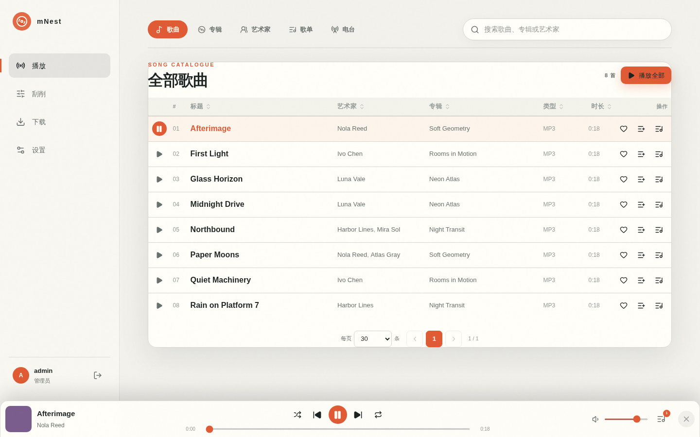
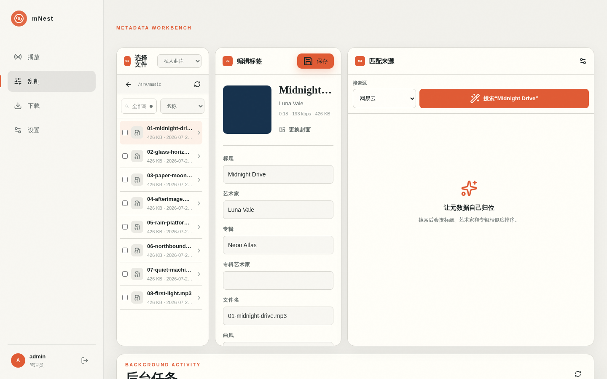
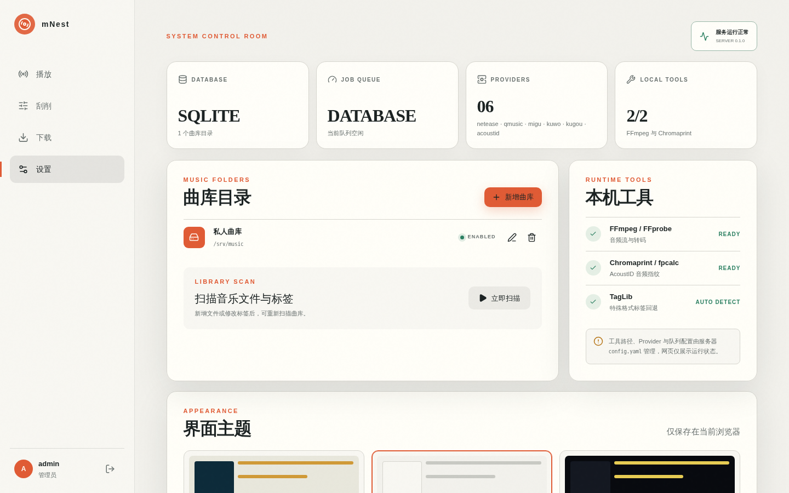

# mNest

mNest 是一个部署在自己服务器上的音乐库管理工具。它可以播放音乐、修正标签、批量刮削封面和歌词、从外部音乐服务下载歌曲，并向手机或桌面播放器提供 OpenSubsonic 服务。

Web 管理界面已经嵌入可执行文件，正常运行时不需要单独部署前端。

## 主要功能

- 浏览和播放歌曲、专辑、艺术家、播放列表与网络电台
- 编辑标题、多个艺术家、专辑、年份、音轨号、碟号、歌词和封面
- 使用网易云、QQ、咪咕、酷我、酷狗和 AcoustID 搜索并匹配元数据
- 标记元信息不完整的歌曲，并在刮削保存后自动更新曲库
- 从网易云、两个 QQ 后端或多个 Subsonic 服务器下载歌曲入库
- 上传本地歌曲到服务器曲库，下载或上传完成后自动建立索引
- 兼容 OpenSubsonic 1.16.1，可连接 Feishin、Symfonium 等客户端
- 支持 Last.fm Now Playing 和 Scrobble，每个用户独立授权
- 支持 SQLite 和 PostgreSQL；任务队列可使用数据库或 Redis
- 提供桌面端和移动端布局，以及三套可切换主题

支持读取和修改 MP3、FLAC、APE、WAV、AIFF、WavPack、TTA、M4A/MP4、OGG、MPC、OPUS、WMA/WMV、DSF/DFF 和 AAC 等格式。

## 界面预览

### 曲库播放器



### 元数据刮削



### 系统设置



## 快速开始

### 1. 准备运行环境

mNest 可执行文件包含 Web 界面，但以下功能仍依赖外部工具：

- `ffmpeg`、`ffprobe`：播放转码、音频信息检测
- `fpcalc`：AcoustID 音频指纹识别
- TagLib：可选，用于部分格式处理

Debian/Ubuntu 可以安装：

```bash
sudo apt install ffmpeg libchromaprint-tools libtagc0
```

### 2. 创建配置

复制示例配置：

```bash
mkdir -p data
cp config.example.yaml config.yaml
```

直接运行二进制时，请将 `config.yaml` 中的 SQLite 地址改为实际可写位置，例如：

```yaml
database:
  driver: sqlite
  url: sqlite://./data/mNest.db?mode=rwc
  max_connections: 10
```

同时确认 `tools` 中的 `ffmpeg`、`ffprobe` 和 `fpcalc` 路径与服务器一致。

如果通过域名或反向代理访问，请将 `server.public_url` 改为用户实际访问的外部地址，例如 `https://music.example.com`。

### 3. 设置初始密码

```bash
export MNEST_ADMIN_PASSWORD='请替换为强密码'
export MNEST_JWT_SECRET='请替换为至少32个字符的随机字符串'
```

`MNEST_JWT_SECRET` 还用于保护保存在服务端的 Cookie、下载源密码和 Last.fm 凭据。部署后应保持不变并妥善备份。

### 4. 启动服务

```bash
chmod +x mNest
./mNest --config ./config.yaml
```

浏览器访问 `http://服务器地址:4535/`，使用用户名 `admin` 和刚才设置的管理员密码登录。

需要后台运行时，可使用 systemd、OpenRC 或其他进程管理工具托管 mNest。

## 首次使用

1. 进入“设置 → 曲库目录”，添加服务器上的音乐目录绝对路径。
2. 新增曲库后会自动开始扫描；也可以在设置页面手动重新扫描。
3. 扫描完成后，在“播放”页面浏览歌曲、专辑和艺术家。
4. 元信息不完整的歌曲会标记为“需要刮削”，可在“刮削”页面搜索并保存匹配结果。
5. 如需从外部服务导入歌曲，先在“设置 → 下载来源”配置后端，再进入“下载”页面搜索、试听和入库。

Docker 部署时，曲库目录必须填写容器内路径。例如主机目录映射为 `/music` 后，设置页面中应添加 `/music`，而不是主机原始路径。

## 数据与文件安全

- SQLite 数据默认保存在 `database.url` 指定的位置。
- 添加曲库只建立索引，不会复制原有音乐文件。
- 删除曲库配置只删除数据库索引，不会删除磁盘上的歌曲。
- 编辑标签、整理目录和写入封面会修改音乐文件，首次使用前建议备份曲库。
- 下载和上传的歌曲会写入设置页面选择的目标曲库。
- 应同时备份数据库、配置文件、`MNEST_JWT_SECRET` 和音乐目录。

管理员账号只在首次启动时创建。修改环境变量中的管理员密码不会自动覆盖数据库中的现有密码。如需从配置同步密码，可临时将 `admin.overwrite_existing` 设为 `true`，成功启动一次后再恢复为 `false`。

## Docker 部署

准备环境变量和配置：

```bash
cp .env.example .env
cp config.example.yaml config.yaml
```

编辑 `.env` 中的管理员密码和 JWT 密钥，再修改 `compose.yaml` 中的音乐目录挂载：

```yaml
volumes:
  - /服务器上的音乐目录:/music:rw
```

Compose 中的数据库和任务队列可以通过以下环境变量覆盖 `config.yaml`：

| 环境变量 | 默认值 | 用途 |
| --- | --- | --- |
| `MNEST_DATABASE_DRIVER` | `sqlite` | `sqlite` 或 `postgres` |
| `MNEST_DATABASE_URL` | `sqlite:///data/mNest.db?mode=rwc` | 数据库连接地址 |
| `MNEST_QUEUE_DRIVER` | `database` | `database` 或 `redis` |
| `MNEST_REDIS_URL` | 空 | Redis 连接地址；启用 Redis 队列时必须设置 |

环境变量优先于 YAML 配置。使用外部 PostgreSQL 或 Redis 时，只需在 `.env` 中修改对应值，无需改动镜像。

启动：

```bash
docker compose up -d --build
```

查看日志：

```bash
docker compose logs -f mNest
```

更新后重新构建并启动：

```bash
docker compose up -d --build
```

## PostgreSQL 与 Redis

个人或小型曲库建议直接使用 SQLite。多用户或任务量较大时，可以使用 PostgreSQL，并将任务队列切换为 Redis。

```bash
cp config.postgres.example.yaml config.postgres.yaml
docker compose -f compose.postgres.yaml up -d --build
```

启动前请同时修改：

- `.env` 中的 `POSTGRES_PASSWORD`
- `.env` 中的管理员密码和 JWT 密钥

PostgreSQL Compose 会自动通过环境变量配置数据库地址和 Redis 队列，不需要再把密码写进 `config.postgres.yaml`。mNest 默认可执行文件同时支持 SQLite 和 PostgreSQL。

## OpenSubsonic 客户端

客户端通常填写服务器地址：

```text
http://服务器地址:4535
```

如果客户端要求填写 REST API 根地址，则使用：

```text
http://服务器地址:4535/rest
```

mNest 支持密码认证、盐值令牌、`enc:` 密码和用户 API Token。更完整的端点兼容情况见 [OPEN_SUBSONIC.md](OPEN_SUBSONIC.md)。

## 下载来源

下载页面由管理员使用。可在设置页面配置：

- [网易云音乐后端](https://github.com/NeteaseCloudMusicApiEnhanced/api-enhanced)，并通过二维码登录；Cookie 保存在 mNest 服务端
- [QQ 音乐](https://github.com/jsososo/QQMusicApi)和 [QQ 音乐 2](https://github.com/Rain120/qq-music-api)后端
- 多个 Subsonic/OpenSubsonic 服务器

网易云和 QQ API 不包含在 mNest 中，需要单独部署，然后在设置页面填写对应后端的根地址。

搜索时可以同时启用一个或多个来源。试听使用 128 kbps 音频；网易云正式下载会请求最高可用码率。下载完成后文件会保存到所选曲库并自动入库。

## Last.fm

1. 管理员在 [Last.fm API](https://www.last.fm/api/account/create) 创建应用。
2. 在“设置 → Last.fm”填写 API Key 和 Shared Secret。
3. 每位用户在自己的设置页面点击“打开授权页”，完成个人账号授权。

内置播放器会发送 Now Playing。长度超过 30 秒的歌曲，在实际播放达到歌曲一半或 4 分钟中的较早时间点后提交 Scrobble。OpenSubsonic 客户端调用 `scrobble` 接口时也会同步上报。

## 常见问题

### 浏览器无法访问

确认 `server.host` 为 `0.0.0.0`，端口 `4535` 未被其他程序占用，并检查服务器防火墙是否允许访问该端口。

### 添加曲库后没有歌曲

确认填写的是服务器可见的绝对路径，运行 mNest 的用户拥有目录读取权限。Docker 中需要填写容器内挂载路径。随后在设置页面查看扫描任务状态。

### 无法转码或识别指纹

检查配置中 `ffmpeg`、`ffprobe`、`fpcalc` 的路径，并在服务器终端直接运行这些命令确认可用。

### OpenSubsonic 客户端登录失败

先确认浏览器能够访问 mNest。客户端服务器地址通常不需要手动添加 `/rest`；只有明确要求 REST 根地址的客户端才填写 `/rest`。如客户端提供“旧版认证”选项，可以根据客户端兼容情况开启。

### 修改 JWT 密钥后已保存的账号失效

下载源密码、Cookie 和 Last.fm 密钥使用 JWT 密钥派生的服务端密钥保护。恢复原来的 `MNEST_JWT_SECRET`，或重新配置相关账号。

## 从源码构建

普通使用者可以直接使用已编译的可执行文件。需要自行构建时，先安装 Rust、Node.js、系统 OpenSSL 开发包和 `pkg-config`：

```bash
npm --prefix web ci
npm --prefix web run build
cargo build --release
```

前端产物会嵌入 Rust 可执行文件。修改前端后，必须先重新构建前端，再编译后端。

默认构建同时包含 SQLite 和 PostgreSQL，也可以只编译一个数据库后端：

```bash
# 仅 SQLite
cargo build --release --no-default-features --features sqlite

# 仅 PostgreSQL
cargo build --release --no-default-features --features postgres
```

GNU/Linux 使用 native-tls 和系统 OpenSSL。musl 目标自动改用 rustls，可构建静态可执行文件：

```bash
rustup target add x86_64-unknown-linux-musl
cargo build --release --target x86_64-unknown-linux-musl
```

## 许可证

[MIT](LICENSE)
